# 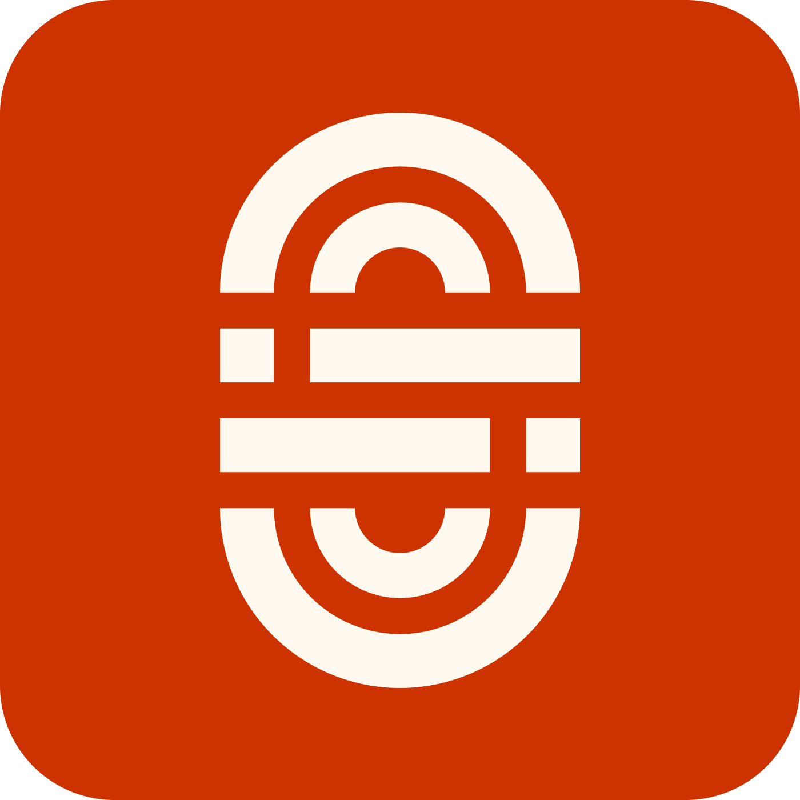 &ensp;D O M I N V M

### Premium Color Themes for Visual Studio Code

**33 meticulously crafted themes** across **11 color families** — each offering **Light**, **Dark**, and **Dark Solarized** variants engineered for visual comfort, accessibility, and a luxurious aesthetic.

> *Dominvm transforms your editor into a refined workspace where every color serves a purpose — from reducing fatigue during marathon coding sessions to creating clear visual hierarchy between UI and content.*

---

## ✦ Design Philosophy

| Principle | Details |
|-----------|---------|
| 🚫 **No Pure White / No Pure Black** | All backgrounds use warm or cool-tinted hues to eliminate glare and haloing |
| ♿ **WCAG AA Compliant** | All syntax tokens meet or exceed **4.5:1** contrast ratio for normal text |
| 🎯 **Visual Hierarchy** | UI chrome uses a distinct tonal range from editor content |
| 🎨 **Semantic Coloring** | 12 dedicated token categories with unique, distinguishable hues |
| 🌡️ **239 Color Tokens** | Complete VS Code token coverage including terminal, git, breadcrumbs, minimap, and more |

---

## ✦ Three Variants Per Family

| Variant | Best For | Style |
|---------|----------|-------|
| ☀️ **Light** | Daytime, bright environments | Warm-tinted off-whites |
| 🌑 **Dark** | Low-light, nighttime coding | Deep, color-tinted darks (L ≈ 3–5) |
| 🌒 **Dark Solarized** | Extended sessions, reduced fatigue | Lifted darks with tinted mid-tones (L ≈ 8–12) |

---

## ✦ Theme Gallery

### Original (Warm Red)

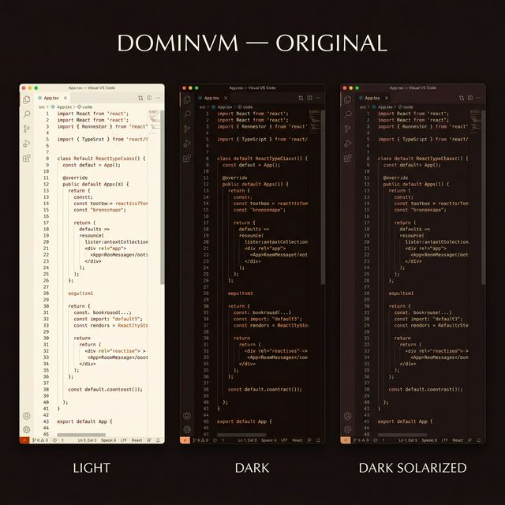

| Theme | Background | Accent | Text |
|-------|-----------|--------|------|
| **Dominvm Light** | `#FFF9F0` Warm White | `#CC3300` Rust | `#402020` |
| **Dominvm Dark** | `#1A0C0C` Charcoal | `#FF9966` Tangerine | `#D4C4B0` |
| **Dominvm Dark Solarized** | `#201215` Rosewood | `#FF9966` Tangerine | `#D4C4B0` |

---

### Green

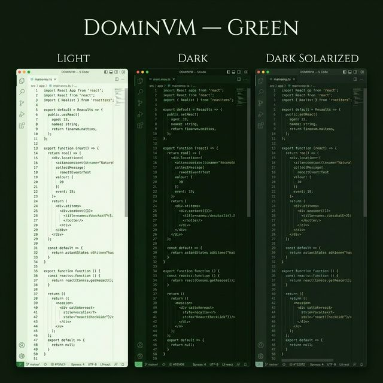

| Theme | Background | Accent | Text |
|-------|-----------|--------|------|
| **Dominvm Green Light** | `#F5FAF0` Mint Cream | `#2E7D32` Green | `#1E3320` |
| **Dominvm Green Dark** | `#0C1A0C` Deep Forest | `#66BB6A` Spring | `#BCD4B0` |
| **Dominvm Green Dark Solarized** | `#122012` Fern Dusk | `#66BB6A` Spring | `#BCD4B0` |

---

### Blue

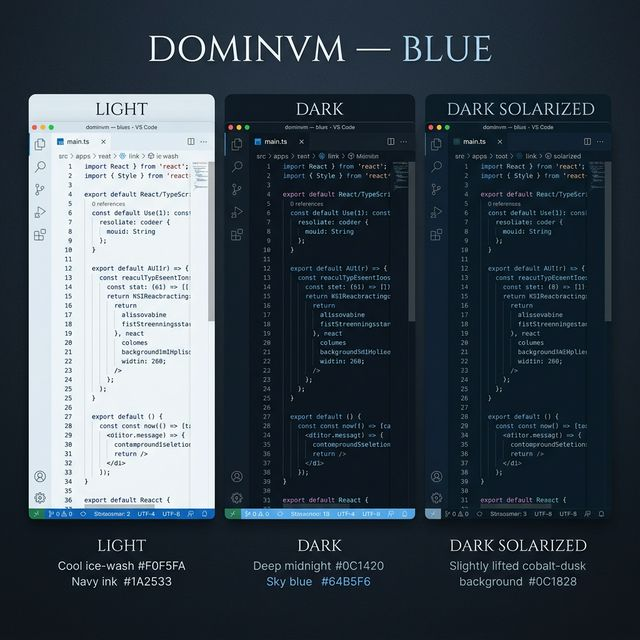

| Theme | Background | Accent | Text |
|-------|-----------|--------|------|
| **Dominvm Blue Light** | `#F0F5FA` Ice Wash | `#1565C0` Blue | `#1A2533` |
| **Dominvm Blue Dark** | `#0C1420` Midnight | `#64B5F6` Sky Blue | `#B0C4D4` |
| **Dominvm Blue Dark Solarized** | `#0C1828` Cobalt Dusk | `#64B5F6` Sky Blue | `#B0C4D4` |

---

### Teal

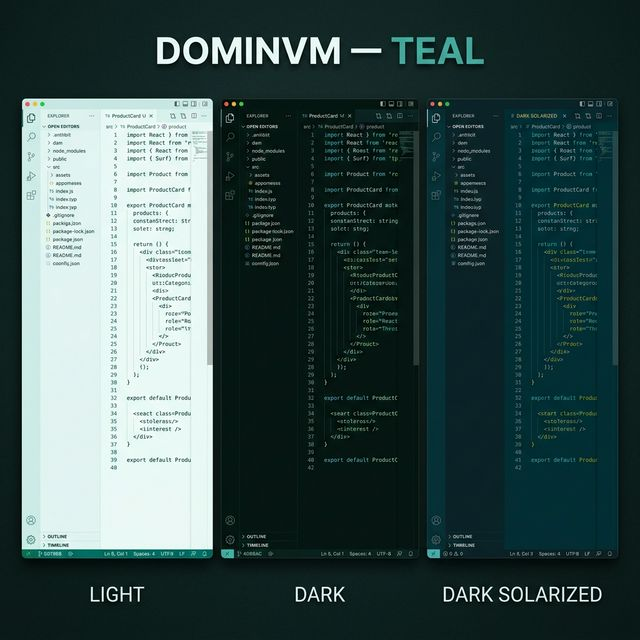

| Theme | Background | Accent | Text |
|-------|-----------|--------|------|
| **Dominvm Teal Light** | `#F0FAF8` Aqua Mist | `#00796B` Teal | `#1A3333` |
| **Dominvm Teal Dark** | `#051210` Abyssal | `#4DB6AC` Aquamarine | `#B0D4D0` |
| **Dominvm Teal Dark Solarized** | `#0E2025` Deep Lagoon | `#4DB6AC` Aquamarine | `#B0D4CC` |

---

### Grey

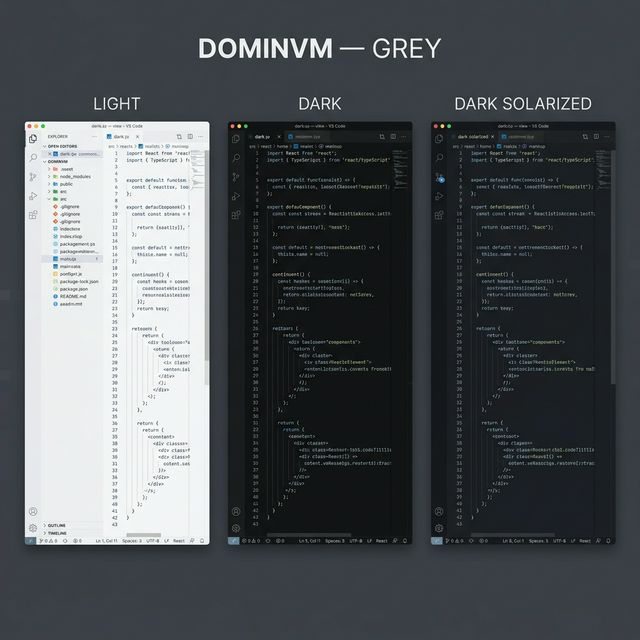

| Theme | Background | Accent | Text |
|-------|-----------|--------|------|
| **Dominvm Grey Light** | `#F5F5F7` Platinum | `#607D8B` Blue Grey | `#252530` |
| **Dominvm Grey Dark** | `#101012` Charcoal | `#90A4AE` Blue Grey | `#C8C8D0` |
| **Dominvm Grey Dark Solarized** | `#1A1A1E` Onyx | `#90A4AE` Blue Grey | `#C8C8D0` |

---

### Sepia

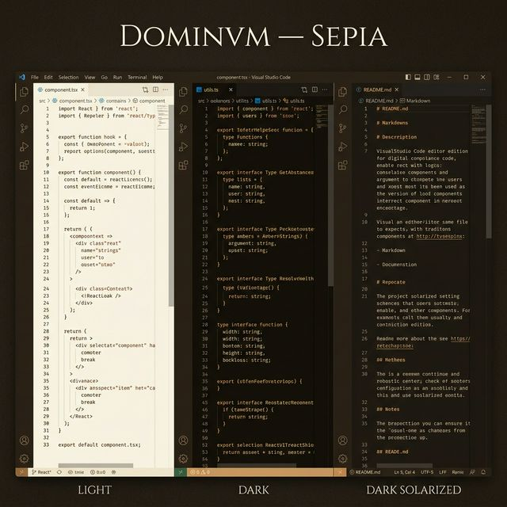

| Theme | Background | Accent | Text |
|-------|-----------|--------|------|
| **Dominvm Sepia Light** | `#FAF5EB` Parchment | `#8D6E4C` Sienna | `#3D2B1F` |
| **Dominvm Sepia Dark** | `#120E0A` Espresso | `#D7A86E` Amber | `#D4C8B8` |
| **Dominvm Sepia Dark Solarized** | `#1E1814` Espresso | `#D7A86E` Amber | `#D4C8B8` |

---

### Yellow

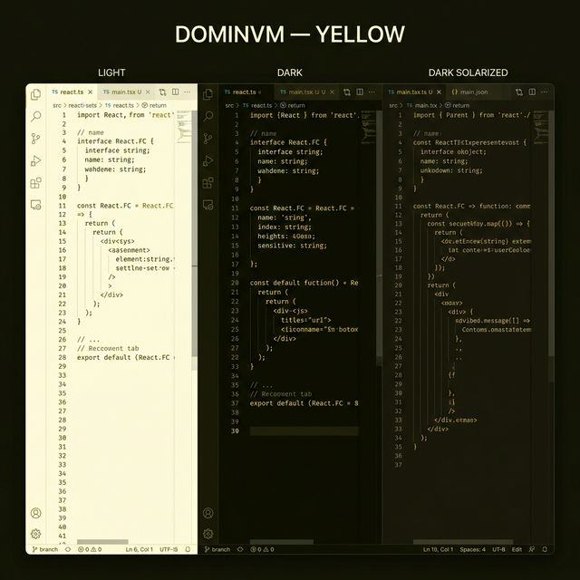

| Theme | Background | Accent | Text |
|-------|-----------|--------|------|
| **Dominvm Yellow Light** | `#FFFDE8` Buttercream | `#9E7700` Dark Gold | `#33300A` |
| **Dominvm Yellow Dark** | `#0E0E05` Olive Night | `#FFD54F` Golden | `#D4D0B4` |
| **Dominvm Yellow Dark Solarized** | `#1C1A0E` Amber Night | `#FFD54F` Golden | `#D4D0B4` |

---

### Orange

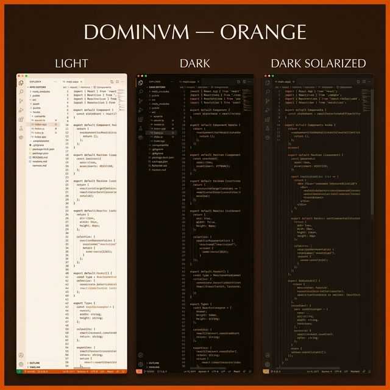

| Theme | Background | Accent | Text |
|-------|-----------|--------|------|
| **Dominvm Orange Light** | `#FFF5EE` Seashell | `#E65100` Deep Orange | `#3D2010` |
| **Dominvm Orange Dark** | `#100A06` Ember | `#FF8A65` Coral | `#D4C4B4` |
| **Dominvm Orange Dark Solarized** | `#1E1410` Mahogany | `#FF8A65` Coral | `#D4C4B4` |

---

### Red

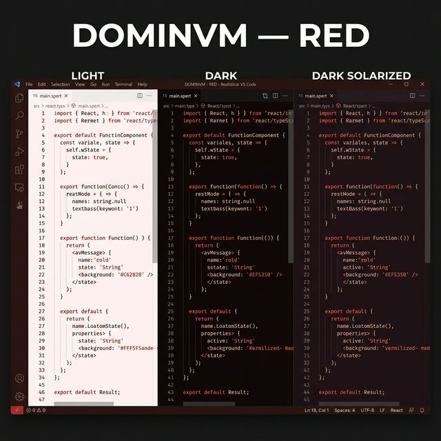

| Theme | Background | Accent | Text |
|-------|-----------|--------|------|
| **Dominvm Red Light** | `#FFF5F5` Rose White | `#C62828` Crimson | `#3D1515` |
| **Dominvm Red Dark** | `#100608` Garnet | `#EF5350` Vermilion | `#D4B8BC` |
| **Dominvm Red Dark Solarized** | `#1E1012` Wine | `#EF5350` Vermilion | `#D4B8BC` |

---

### Pink

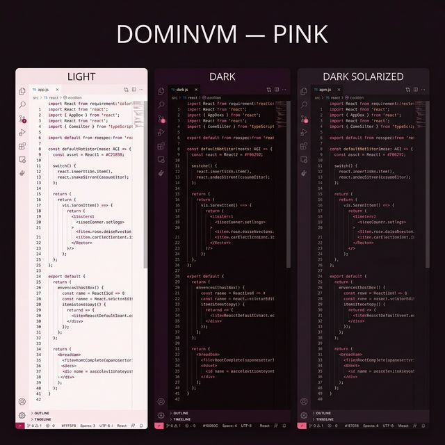

| Theme | Background | Accent | Text |
|-------|-----------|--------|------|
| **Dominvm Pink Light** | `#FFF5F9` Blush White | `#C2185B` Deep Pink | `#3D1528` |
| **Dominvm Pink Dark** | `#10060C` Plum | `#F06292` Hot Pink | `#D4B8C8` |
| **Dominvm Pink Dark Solarized** | `#1E1018` Plum Night | `#F06292` Hot Pink | `#D4B8C8` |

---

### Purple

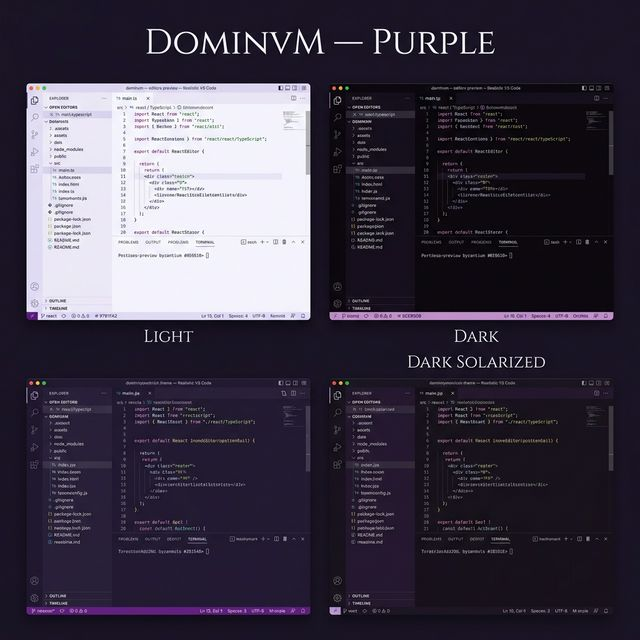

| Theme | Background | Accent | Text |
|-------|-----------|--------|------|
| **Dominvm Purple Light** | `#F8F5FF` Lavender | `#7B1FA2` Deep Purple | `#281540` |
| **Dominvm Purple Dark** | `#0C0610` Byzantium | `#CE93D8` Orchid | `#C8B8D4` |
| **Dominvm Purple Dark Solarized** | `#18101E` Amethyst | `#CE93D8` Orchid | `#C8B8D4` |

---

## ✦ Syntax Highlighting

Every Dominvm theme uses **12 semantic token categories** for consistent visual structure across all languages:

| Category | Purpose | Example Scopes |
|----------|---------|---------------|
| 💬 **Comments** | Annotations & docs | `comment`, `string.comment` |
| 🔑 **Keywords** | Language constructs | `keyword`, `storage`, `entity.name.tag` |
| 📝 **Strings** | Text literals | `string`, `string.quoted` |
| ⚡ **Functions** | Callable entities | `entity.name.function`, `support.function` |
| 🏗️ **Classes & Types** | Type definitions | `entity.name.class`, `support.type` |
| 📦 **Variables** | Data references | `variable`, `variable.parameter` |
| 🔢 **Constants** | Fixed values | `constant.numeric`, `constant.language` |
| 🔗 **Properties** | Object keys | `meta.object-literal.key` |
| ⚙️ **Operators** | Symbols & punctuation | `keyword.operator`, `punctuation` |
| 📌 **Headers** | Section titles | `markup.heading` |
| ✍️ **Markup** | Rich text formatting | `markup.bold`, `markup.italic` |
| 🔍 **Regex & Escapes** | Pattern matching | `string.regexp`, `constant.character.escape` |

---

## ✦ Complete Token Coverage

Every theme includes **239 color tokens** covering:

<table>
<tr><td>

| Category | Tokens |
|----------|--------|
| Editor & Chrome | 80+ |
| Terminal ANSI | 20 |
| Git Decorations | 7 |
| Breadcrumbs | 4 |
| Notifications | 9 |

</td><td>

| Category | Tokens |
|----------|--------|
| Minimap & Ruler | 16 |
| Inlay Hints | 6 |
| Merge Conflicts | 5 |
| Debug Toolbar | 8 |
| Settings & UI | 10+ |

</td></tr>
</table>

---

## ✦ Installation

### 📦 From VS Code Marketplace

1. Open **Extensions** panel (`Ctrl+Shift+X` / `⌘⇧X`)
2. Search for **Dominvm Theme**
3. Click **Install**
4. Select your theme: `Ctrl+K Ctrl+T` / `⌘K ⌘T`

### 📁 From VSIX

1. Download the latest `.vsix` file
2. **Extensions** → **⋯** → **Install from VSIX…**
3. Select the downloaded file

---

## ✦ Recommended Settings

For the full Dominvm experience:

```json
{
  "editor.fontFamily": "'DM Mono', 'Courier New', monospace",
  "editor.fontSize": 14,
  "editor.lineHeight": 1.6,
  "editor.cursorBlinking": "smooth",
  "editor.smoothScrolling": true
}
```

---

## ✦ License

[MIT](LICENSE)
